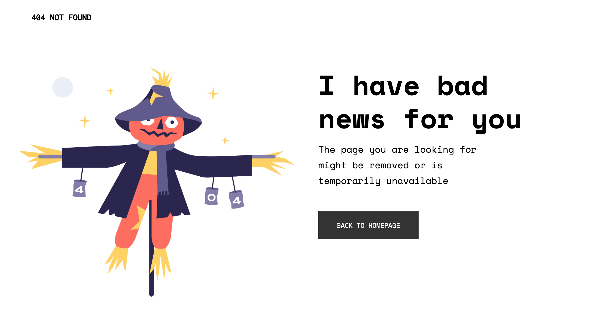

# 404-page

This is a simple 404 page. The aim of this project is to setup a static page using react and sass.

# Acknowledgments

The design and content comes as a challenge from the website [devchallenges.io](https://devchallenges.io/challenges/wBunSb7FPrIepJZAg0sY)

# Tools Used

- HTML, SASS, JS
- React
- Bootstrapped using Create React App

# Learning

This project was a small but important step do put together all the moving parts to put together a simple static page using react.

Starting with bootstrapping using create-react-app. I made use of functional components to build the page as the contents are static. I also made use of a simple structure of keeping the components and styles in separate folder this might have been sufficient for this project, but I will create separate folder for each component where the component JSX file and style will stay together.

# Problems and solutions

This was a very small project but here are some problems that I faced with solutions I found.

- Applying Master Reset - I decided to place the master css reset to the main App.js file and this seems to work great so far.
- Google fonts - It caught me by surprise that the Google fonts that I was using to be called from the components css file. To avoid this I decide to link the Google font in the `index.html` file in the public folder with link tags then all I had to do was to apply the font-family attribute in the components and everything worked well.
- Adding images in React - I couldn't get the images to load on the webpage with just the `src="..linkToFile"`. After some googling I found out that images are added either with `import` statement or the `require()` function.
  I decided to use the latter approach since using import statement for every image makes the list of import statements massive.

# Helpful links

- [GitHub CLI Manual](https://cli.github.com/manual/)
- [Create React App - Getting Started Guide](https://create-react-app.dev/docs/getting-started)
- [Importing Images with React](https://stackabuse.com/importing-images-with-react/)
